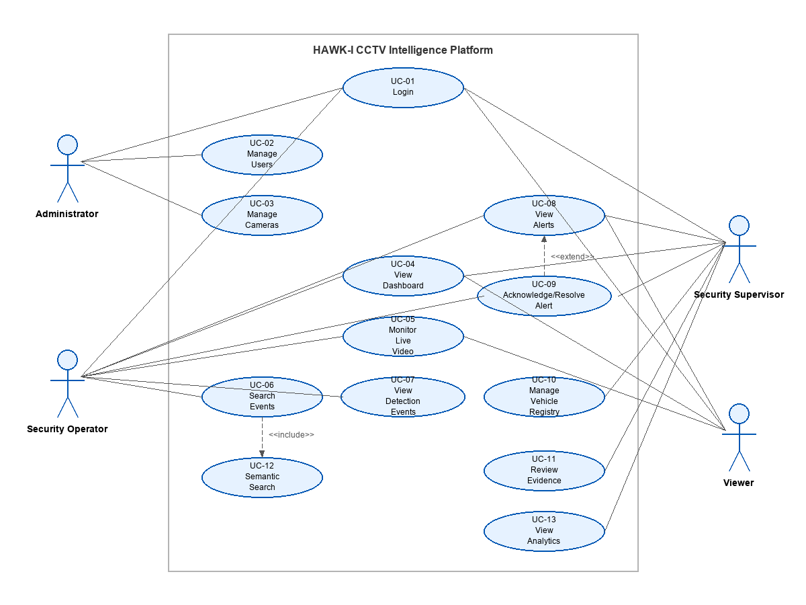

# Use Cases

## Actors
- **Administrator:** Manages platform configurations, users, and connected cameras.
- **Security Operator:** Monitors live status logs, reviews events, and acknowledges active security alerts.
- **Security Supervisor:** Oversees security response, reviews resolved alerts, manages vehicle registries, and reviews analytics.
- **Viewer:** Has read-only access to live metrics, dashboard metrics, and alerts logs.

---

## System Use Cases Overview



```mermaid
usecaseDiagram
  actor Administrator
  actor "Security Operator" as Operator
  actor "Security Supervisor" as Supervisor
  actor Viewer

  Administrator --> (UC-01 Login)
  Administrator --> (UC-02 Manage Users)
  Administrator --> (UC-03 Manage Cameras)

  Operator --> (UC-01 Login)
  Operator --> (UC-04 View Dashboard)
  Operator --> (UC-05 Monitor Live Video)
  Operator --> (UC-06 Search Events)
  Operator --> (UC-07 View Detection Events)
  Operator --> (UC-08 View Alerts)
  Operator --> (UC-09 Acknowledge/Resolve Alert)

  Supervisor --> (UC-01 Login)
  Supervisor --> (UC-04 View Dashboard)
  Supervisor --> (UC-08 View Alerts)
  Supervisor --> (UC-09 Acknowledge/Resolve Alert)
  Supervisor --> (UC-10 Manage Vehicle Registry)
  Supervisor --> (UC-11 Review Evidence)
  Supervisor --> (UC-12 View Analytics)

  Viewer --> (UC-01 Login)
  Viewer --> (UC-04 View Dashboard)
  Viewer --> (UC-05 Monitor Live Video)
  Viewer --> (UC-08 View Alerts)
```

---

## Detailed Use Cases

### UC-01 Login
- **Actor:** Administrator, Security Operator, Security Supervisor, Viewer
- **Goal:** Gain authorized access to the HAWK-I dashboard.
- **Precondition:** User account has been created in the database.
- **Main Flow:**
  1. User enters their Operator ID (username) and Security Clearance Key (password) on the login screen.
  2. The system hashes the password and validates the credentials.
  3. The system returns a JWT token indicating user credentials and user role.
- **Expected Result:** The user is logged in and redirected to the Command Center dashboard.

### UC-03 Manage Cameras
- **Actor:** Administrator
- **Goal:** Add a new camera feed to the monitoring platform.
- **Precondition:** The administrator is logged in and on the Zones & Cameras page.
- **Main Flow:**
  1. The administrator clicks "Add Camera".
  2. Enters camera details: Name (e.g. CAM-09), Location, and Zone Type.
  3. Clicks "Save".
- **Expected Result:** The camera is stored in the database and visible in the active feeds list.

### UC-06 Search Events
- **Actor:** Security Operator, Security Supervisor
- **Goal:** Locate specific surveillance events using natural language text search.
- **Precondition:** User is authenticated and on the Search page; historical events are embedded.
- **Main Flow:**
  1. User types a query (e.g., "unregistered vehicle speeding near gate").
  2. System converts the query into a text embedding via the ML service.
  3. System calculates cosine similarities against all stored event embeddings.
  4. System displays the closest matching events sorted by percentage similarity score.
- **Expected Result:** The user sees a list of matching historical events with high-contrast indicator cards.

### UC-09 Acknowledge/Resolve Alert
- **Actor:** Security Operator, Security Supervisor
- **Goal:** Review and close an active security alert.
- **Precondition:** An alert has been generated and is visible in the alerts panel.
- **Main Flow:**
  1. User navigates to the Alerts view and clicks on an "Open" alert.
  2. Reviews the associated event description, timestamp, and camera metadata.
  3. Clicks "Acknowledge" or "Resolve".
- **Expected Result:** The alert status updates in the database and is removed from the active alerts list.

### UC-10 Manage Vehicle Registry
- **Actor:** Security Supervisor
- **Goal:** Whitelist a vehicle to prevent unauthorized access alerts.
- **Precondition:** Supervisor is authenticated.
- **Main Flow:**
  1. Supervisor navigates to the Vehicle Log/Registry configuration.
  2. Clicks "Register Vehicle" and enters the license plate and owner details.
  3. Clicks "Confirm".
- **Expected Result:** The vehicle is added to the database registry table, allowing the ANPR module to identify it as "registered".

---

## Detection Functions & AI Services

### ANPR / Number Plate Recognition (Module 1)
- **Operation:** Extracts license plates from frames via YOLOv8, reads text using EasyOCR, and validates against the database registry to identify unregistered vehicles.

### Object Misplacement Detection (Module 2)
- **Operation:** Aligns reference and current frames to identify pixels indicating appeared or disappeared items, classifying object types in the reference frame bounding box to flag missing items.

### Velocity Detection (Module 4)
- **Operation:** Tracks moving bounding boxes across frames using ByteTrack, calculates vehicle speed using coordinate shifts relative to the video FPS, and flags speeding events.

### Unauthorized Entry Detection (Module 5)
- **Operation:** Identifies human bounding boxes entering interior zones, checks gate access logs for corresponding entries, and flags intrusions if no correlation is found.

### Threat / Anomaly Detection (Module 6)
- **Operation:** Monitors trajectories and spatial relations (e.g. person near perimeter at midnight or specific object overlaps) and logs high-priority threat alerts.

### Semantic Search (Module 3)
- **Operation:** Generates text embeddings using `all-MiniLM-L6-v2` for historical event descriptions, enabling natural language lookup via cosine similarity scores.
